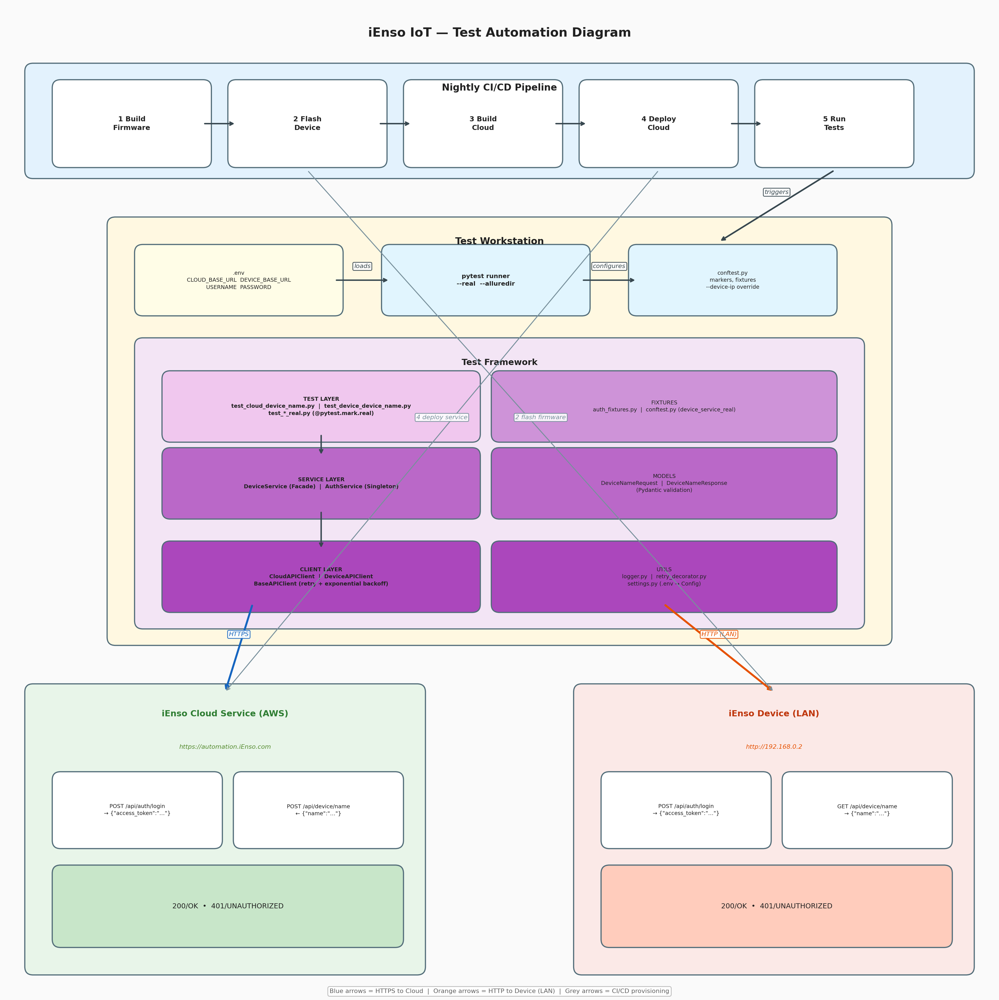

1. Test Automation High-Level Design
a. Description
Describe, in high-level, how you would design the automation system, major consideration
points, possible pitfalls, etc.
# 1. High-Level Design

### 1.1 Layered Architecture

The framework is built in **four layers**, each with a single responsibility:

```
Tests  →  Services  →  Clients  →  REST APIs (Cloud / Device)
```

| Layer | Files | Responsibility |
|---|---|---|
| **Test** | `test_cloud_*.py`, `test_device_*.py` | Test logic, assertions, parametrization |
| **Service** | `DeviceService`, `AuthService` | Business workflows (set name → verify on device) |
| **Client** | `CloudAPIClient`, `DeviceAPIClient` | Raw HTTP calls to specific endpoints |
| **Infrastructure** | `BaseAPIClient`, `retry_decorator`, `settings` | Retry logic, config, logging |

**Reason For Layered Architecture** A test never constructs a URL or manages a token directly. If an API endpoint changes only the client layer changes — tests don't need updating.

### 1.2 Key Design Decisions

**a) Two separate clients, one base class**
- The cloud and device have different base URLs and different APIs so they get separate clients.
- Common behavior (headers, retry, timeout) lives in `BaseAPIClient` using the **Template Method** pattern — subclasses only override `get_base_url()`.

**b) AuthService as a Singleton with token caching**
- Authentication is expensive (network call). The singleton caches tokens so 50 tests share one login instead of logging in 50 times.
- `force_refresh` parameter handles token expiry mid-run.

**c) Facade pattern (DeviceService)**
- Tests call `change_device_name_via_cloud("name")` — one line. Under the hood it authenticates, validates input via Pydantic, calls the cloud API, and structures the response. This keeps tests clean and readable.

**d) Configuration externalized to `.env`**
- URLs, credentials, timeouts all come from `.env` (never hardcoded).
- Same codebase runs against different environments by swapping the `.env` file loaded by python-dotenv
- This allows the same code to run in different environments (CI/CD nightly,local dev) by simply swapping the .env file.

**e) Retry with exponential backoff**
- Every HTTP call is wrapped with `@retry(max_attempts=3, backoff=2)`.
- This handles transient network issues — critical for IoT devices on potentially unreliable networks.
- Network calls are wrapped with a @retry decorator (utils/retry_decorator.py)to handle transient failures — critical for IoT devices on unreliable networks.

**f) Mocked Unit Tests + Real Integration Tests**
- Default test run: all API calls are mocked (pytest-mock) so tests are fast, deterministic, and runnable without hardware.
- CI/CD nightly run: tests marked @pytest.mark.real can be executed with --real flag against the actual device (192.168.0.2) and cloud(https://automation.ienso.com) after firmware/cloud deployment.

**g) Allure Reporting **
- pytest --alluredir=allure-results generates reports for the nightly CI/CD pipeline.

### 1.3 Two Test Modes

| Mode | Command | What happens |
|---|---|---|
| **Mocked** (default) | `pytest tests/` | All HTTP calls mocked via `pytest-mock`. Fast, deterministic, no hardware needed. |
| **Real** (CI/CD nightly) | `pytest tests/ --real` | Tests marked `@pytest.mark.real` hit the actual cloud + device. |

locally the tests can be run in <1 second, while the nightly CI/CD validates against real hardware.

### 1.4 CI/CD Integration

The nightly pipeline runs 5 steps in sequence:

```
Build Firmware → Flash Device (192.168.0.2) → Build Cloud → Deploy Cloud → Run Tests
```

The test workstation just needs:
- Network access to the device (LAN) and cloud (HTTPS)
- A `.env` with the right URLs and credentials
- `pytest tests/ --real --alluredir=allure-results`

---

Create a diagram showing the test automation solution block diagram.
The diagram should illustrate how the test automation system interacts with the hardware
device and the cloud service.
---
BLOCK DIAGRAM OF THE AUTOMATION 
===============================================================================
  



---


 CONSIDERATIONS & POTENTIAL PITFALLS
================================================================================
  1) Network Reliability
     - The device is on a local network (192.168.0.2). Flaky Wi-Fi or network partitions can cause intermittent test failures.
     - Mitigation: Retry decorator with exponential backoff, configurable timeout via .env.
     
  2) Firmware Update Timing
     - After flashing new firmware, the device needs time to boot and become reachable.
     - Mitigation: CI/CD should include a health-check wait step before running tests ( loop GET /api/device/name until 200 is received).
     
  3) Cloud Deployment Propagation
     - Newly deployed cloud services may take time to become fully available.
     - Mitigation: same health-check polling approach.
     
  4) Test Isolation
     - The device name is shared state. Tests that modify it can interfere with each other if run in parallel.
     - Mitigation: tests reset state in setup/teardown, avoid pytest-xdist parallelism for integration tests against real hardware.
     
  5) Token Expiry
     - If the test suite takes a long time, tokens may expire mid-run.
     - Mitigation: AuthService supports force_refresh; tests can catch 401 and re-authenticate.
     
  6) Security
     - Credentials must never be committed to version control.
     - Mitigation: .env is gitignored; CI/CD injects secrets via environment variables.
     
  7) Device Access
     - SSH access is allowed for test devices but not for production devices.
     - Mitigation: Production devices use a reverse proxy mechanism to connect and update firmware.
---
Define 10 Test Cases:
Propose five different test cases for testing the system. You do not need to include dedicated tests
for the login functions (however, you should use the Login APIs for authentication).
The test cases should cover various scenarios for the Get Device Name and Set Device Name
functionalities.  
---  
  TEST CASES 
================================================================================

  Cloud API — Set Device Name (POST /api/device/name)
  ───────────────────────────────────────────────────
 | Test case | Tests | Expected Output |
|-----------|-------|------------------|
| **TC_CLOUD_01** | Set valid name | `200 OK` — device reports new name |
| **TC_CLOUD_02** | Empty string | `400 Bad Request` — Validation error (rejected) |
| **TC_CLOUD_03** | 100-char name (max) | `200 OK` — accepted |
| **TC_CLOUD_04** | 101-char name | `400 Bad Request` — Validation error (rejected) |
| **TC_CLOUD_05** | Special / Unicode | `200 OK` — name preserved exactly |
| **TC_CLOUD_06** | Invalid/expired token | `401 UNAUTHORIZED` |
| **TC_CLOUD_07** | Whitespace-only name | `400 Bad Request` — Validation error (rejected) |

  Device API — Get Device Name (GET /api/device/name)
  ───────────────────────────────────────────────────
  | Test case | Tests | Expected Output | Notes |
|-----------|-------|-----------------|-------|
| **TC_DEVICE_01** | Get name after cloud change | `200 OK` — Returns updated name | Verifies cloud → device sync |
| **TC_DEVICE_02** | Get default name | `200 OK` — Non-empty string | Factory default / first boot |
| **TC_DEVICE_03** | Invalid token | `401 UNAUTHORIZED` | Rejects unauthenticated requests |
| **TC_DEVICE_04** | Name persists after reboot | `200 OK` — Same name returned | Stored in non-volatile memory |
| **TC_DEVICE_05** | Concurrent reads | `200 OK` — All return same name | Thread-safe / race-condition free |
    
--- 
  HOW TO RUN
================================================================================
  # Setup

After cloning the repo, `cd` into `test_framework`:

```bash
	cp .env.example .env          # edit with real credentials
	python3 -m venv .venv         # create virtual environment
	source .venv/bin/activate     # activate virtual environment
	pip install -r requirements.txt

  # Run with mocks (no hardware needed)
  pytest tests/ -v

  # Run against real hardware (nightly CI/CD)
  pytest tests/ --real -v --alluredir=allure-results

  # Generate Allure report
  allure serve allure-results 
        or
  npx allure serve allure-results
```

## Docker

```bash
# Run mocked tests
docker compose run --rm tests

# Run a specific test file
docker compose run --rm tests tests/test_cloud_device_name.py -v

# Run real integration tests (requires .env with valid credentials)
docker compose run --rm tests tests/ --real -v

# View Allure report at http://localhost:5050 or http://localhost:5050/allure-docker-service/latest-report
docker compose up allure
```
